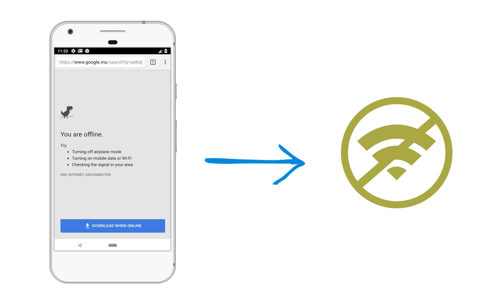
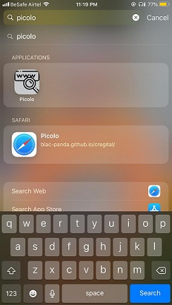
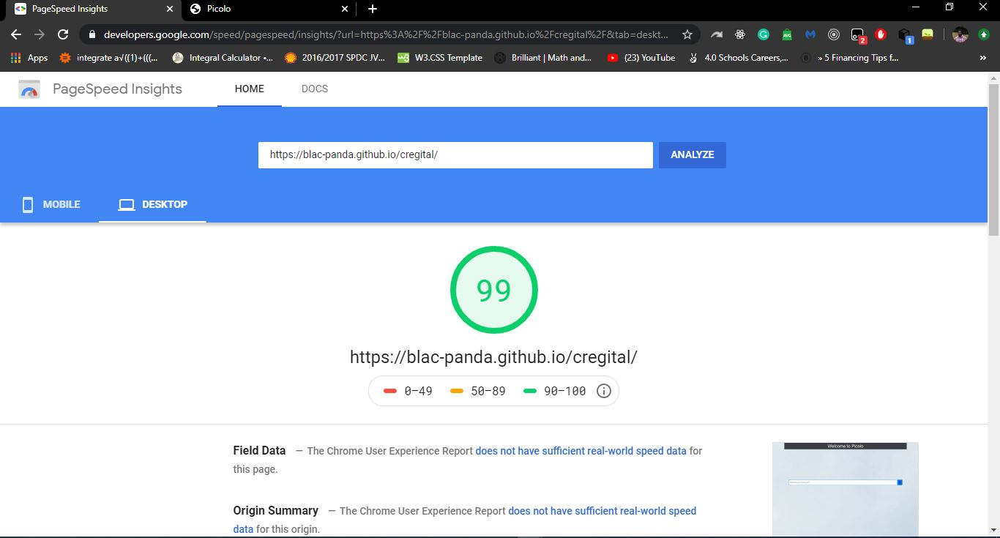

If you're a developer I'm sure you've probably heard people talk about PWA and you probably wonder why its become quite popular, well let's figure that out together.


## What is a Progressive Web Application (PWA)?

A Progressive Web App (PWA) is a web app that uses modern web capabilities to deliver an app-like experience to users.
It delivers a new level of quality, which allows Progressive Web Apps to earn a place on the user's home screen.

## Who cares?

## Your user does!

Nowadays, the expectation from our websites is very high. Over two decades ago when the website was invented, its sole purpose was to share information.
Today, the website can do almost anything. Today, more than 60% of total internet usage is happening via mobile phone.
Wanna know how many mobile devices there are today?

[5.16 billion according to to the latest data from GSMA Intelligence](https://datareportal.com/global-digital-overview) Yeah, that many.


It is important to have fast loading web apps, to improve experience of your users. Statiscally speaking, if your web page load time goes form 1 second to 10 seconds, there is a 123% probability the user will leave the web page. Of course, do you think your users are going to want to wait 10 seconds for your web page to load?


Beyond speed, interaction also matter, splash screen, your users should never be left wondering whether their interaction was registered or not, for example, user clicking a button and there is not change is color or any form of animation on the button, user is unsure if the action was registered.

Finally, reliable applications need to be usable regardless of network connection. Users expect apps to start up on slow or flaky network connections or even when offline. When a request isn't possible due to poor connection or any event, users expect to be told there's trouble instead of the site failing or crashing.

---

Installed Progressive Web Apps run in a standalone window instead of a browser tab. They're launchable from on the user's home screen, dock, taskbar, or shelf. It's possible to search for them on a device and jump between them with the app switcher, making them feel like part of the device they're installed on. Similar to native applications.

---

> You see these three things mentioned above are the pillars of Progressive Web Applications. They are web applications that have  been designed so they are capable, reliable, and installable. 

## Only with modern UI frameworks?

No no no, certain people think that a PWA is coupled with the latest UI frameworks like ReactJS, Angular or Vue.js. PWA has nothing to do with the framework you are using, it only needs certain required components.
Shortly we'll look at what the components structure of a PWA should look like, but first lets talk about the necessary components.

## Technical components of a PWA?

PWA has some important technical components which work together and energizes the regular web app. The following components are required to develop a good PWA.

1. Service Worker
2. manifest.json
3. HTTPS

---

* 1. Service Worker

> Wondering how some web app seem to function partially even without network ?

Our web apps talk to the network directly and if there is no network, the screen shows the famous dinosaur.



To optimize this process, for the first-time load, the service worker stores the required resources in the browser cache. And when the user visits the app next time, the service workers check the cache and returns the response to the user before even checking the network.

Service workers (client-side proxies that pre-cache key resources) enable PWAs to load instantly and provide an instant,
reliable experience for users, regardless of the network state.

This can speed up the performance of your app, wheter the device is connected to the internet or not.
The developer can have full control over the behavior of the app and how it should respond in various scenarios. The service worker has its own lifecycle events.

Now lets look at the process of creating a Service Worker:

 ---

Step 1: Register a Service Worker

Create a new worker.js file in the public folder (public/worker.js) and add the following code:

```jsx
Let CACHE_NAME = 'your-app-name';
Let urlsToCache = [
  '/',
  '/url-name'
];

// Install a service worker
self.addEventListener('install', event => {
  event.waitUntil(
    caches.open(CACHE_NAME)
      .then(function(cache) {
        console.log('Cache Opened');
        return cache.addAll(urlsToCache);
      })
  );
});

// Cache and return requests
self.addEventListener('fetch', event => {
  event.respondWith(
    caches.match(event.request)
      .then(function(response) {
        // Cache hit - return response
        if (response) {
          return response;
        }
        return fetch(event.request);
      }
    )
  );
});

// Update a service worker
self.addEventListener('activate', event => {
  Let cacheWhitelist = ['your-app-name'];
  event.waitUntil(
    caches.keys().then(cacheNames => {
      return Promise.all(
        cacheNames.map(cacheName => {
          if (cacheWhitelist.indexOf(cacheName) === -1) {
            return caches.delete(cacheName);
          }
        })
      );
    })
  );
});
```

> Note! from above code replace (your-app-name) with your app name

---

Step 2: Now Update HTML
Update your index.html file in the public folder (public/index.html)
to check if the client’s browser supports service workers. Just Add below code inside the body tag of your app's (public/index.html)

```jsx
<script>
      if ('serviceWorker' in navigator) {
        window.addEventListener('load', function() {
          navigator.serviceWorker.register('worker.js').then(function(registration) {
            console.log('Worker registration successful', registration.scope);
          }, function(err) {
            console.log('Worker registration failed', err);
          }).catch(function(err) {
            console.log(err);
          });
        });
      } else {
        console.log('Service Worker is not supported by browser.');
      }
    </script>
```

---

Step 3: Activating ServiceWorker (in ReactJS)
Now go to your app's index.js in the src folder (src/index.js)

Now Update serviceWorker.unregister() to serviceWorker.register() Like Below Code At Last Line

```jsx
import React from 'react';
import ReactDOM from 'react-dom';
import './index.css';
import App from './App';
import * as serviceWorker from './serviceWorker';

ReactDOM.render(<App />, document.getElementById('root'));

serviceWorker.register();
```

> If npm was already running, you'll have to restart (npm start) and reload your React app — you should see the message “Worker registration successful” in the console.

* 2. Manifest.json

Manifest is a simple JSON file that tells the browser about your web application and how it should behave when 'installed' on the user's mobile device or desktop. Having a manifest is required by Chrome to show the Add to Home Screen prompt.

A typical manifest file includes information about the app name, icons it should use, the start_url it should start at when launched, and more.

```jsx
{
  "short_name": "Picolo",
  "name": "Picolo Image Searcher",
  "icons": [
    {
      "src": "favicon.ico",
      "sizes": "64x64",
      "type": "image/x-icon"
    },
    {
      "src": "favicon.ico",
      "sizes": "192x192",
      "type": "image/x-icon"
    }
    }
  ],
  "start_url": "/",
  "orientation": "potrait",
  "display": "standalone",
  "theme_color": "#000000",
  "background_color": "#ffffff"
}
```

## Tools and libraries

There are few open source tools available which enhance and make it easy to develop PWA by running series of test to ensure you web app meeet all the requirements to perform as a PWA. they also provide you with ratings

- [Lighthouse](https://developers.google.com/web/tools/lighthouse)
- [Page Speed Insights](https://developers.google.com/speed/pagespeed/insights/) (which I'll use later on to test a sample).

Here is the link to a simple image search application, created with ReactJS and Pexels API. Lets see how it performs pre PWA and post PWA (lol, just made the pre - post thing up).

---

Picolo's performance before I converted it to a PWA.


---

Here's a look, feel free to visit [Picolo](blac-panda.github.io/cregital) to check it out:

## Add to Homescreen prompt   

 

## Application added to hompage



---

Let's take a look at it's performance after I converted it.



Now thats what I'm talking about !! 